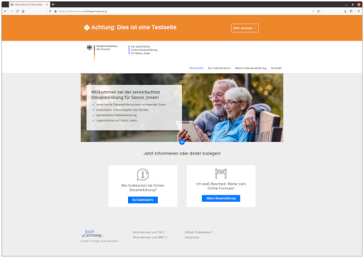
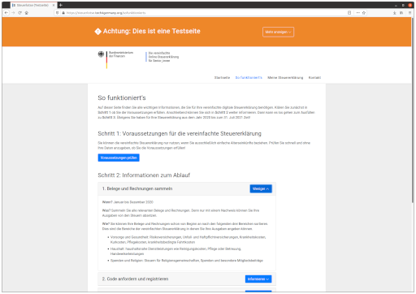
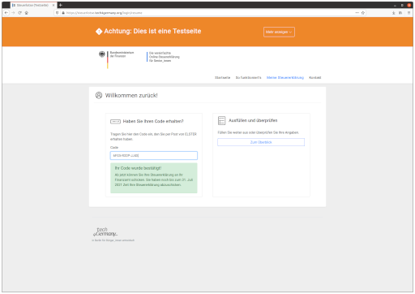
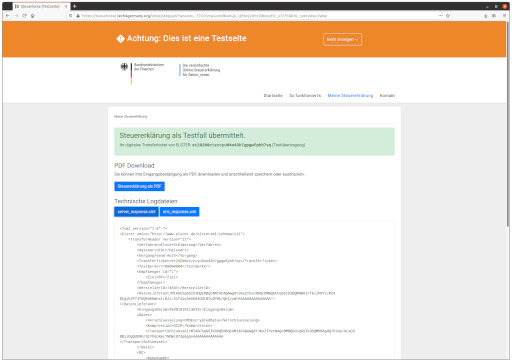
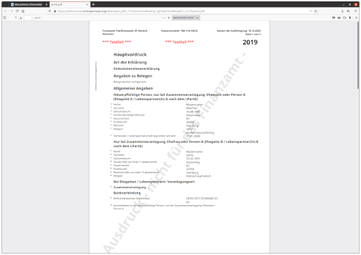

# Steuerlotse


🇬🇧 This is the code repository of the _Steuerlotse_ project by Tech4Germany.
You can use this code under the terms of the provided license.

🇩🇪 Die ist das Quellcodearchiv des _Steuerlotsenprojekts_ von Tech4Germany.
Sie können den Code unter den Bedingungen der angegeben Lizenz nutzen.

## General Information / Generelle Informationen

🇬🇧 This is only a prototype and it cannot be used for any real tax purposes.
Its goal is to illustrate how a solution _can_ look like.
As a result many parts of the tool are simulated and mocked.
However, key technical challenges such as the transmission of test data to ELSTER do work.

🇩🇪 Dies ist nur ein Prototyp, der nicht für echte Steuererklärungen genutzt werden kann.
Das Ziel ist zu illustrieren, wie eine Lösung aussehen _kann_.
Dementsprechend sind viele Funktionalität lediglich simuliert.
Einige technische Herausforderungen, wie die Übertragung von Testdaten an ELSTER, funktionieren beispielhaft.

<a href="documentation/screen_landing_page.png"></a>
<a href="documentation/screen_info_page.png"></a>
<a href="documentation/screen_code_entry.png"></a>
<a href="documentation/screen_ack_page.png"></a>
<a href="documentation/screen_ack_pdf.png"></a>

### Things that work

- Authenticated test data delivery to ELSTER
    - Wrapper named `PyEric` for the `libericapi.so` using `ctypes`
    - Uses a local test certificate (not included in the repo, but in the live demo)
    - Generates a confirmation as PDF
    - Displays server response and transfer ticket
- Landing page and information pages match latest design iteration
- Multi step flow that maintains its state even on force-refresh and browser history navigation
- Expiry and deletion of test entries after 10 minutes
- Unittests

The prototype flow is initialised with test data when opened the first time.

### Things that do not work

- Not all fields are mapped to ELSTER identifiers (i.e. they will not appear in the confirmation PDF)
- Everything related to login and registration is simulated to allow easy testing
- Not all fields are validated
- Not all pages match the latest design iteration.


## For Developers 👩‍💻 👨‍💻

### Build and run 💻

For developing I suggest running the Flask app locally. Assuming that you are on a UNIX-like OS, the following commands should get you up and running:

```bash
# Only first-time setup
git clone git@github.com:tech4germany/steuerlotse.git;
cd steuerlotse;
python3 -m venv venv;
source venv/bin/activate;
pip3 install -r requirements.txt;

# At the beginning of every development session
export FLASK_APP=app;
export FLASK_ENV=debug;

# After every translation change (new strings, updated .po file)
# and also during first-time setup
./scripts/babel_run.sh;

# After major code changes (rest should re-load automatically)
flask run;
```

Then the website is up and running on http://127.0.0.1:5000.

The `docker-compose` currently only works for the production deployment. 
However, there is also a `docker-compose-dev.yml` for spinning up a local MongoDB is you need to test it.

### PyEric 🐍

`PyEric` is our wrapper around the ELSTER Rich Client `ERiC`.
Unfortunately, we cannot include the `ERiC` library in this repository.

If you are interested in testing the integration locally, the `ERiC` library that is available for registered developers on the [ELSTER dev portal](https://www.elster.de/elsterweb/infoseite/entwickler).
You will also need to request test certificates in oder to send authenticated data to the ELSTER services.

The required setup is described in `pyeric/README.md`.

### Website components overview 🏗️

The app is built using the [Flask framework](https://flask.palletsprojects.com/en/1.1.x/) for Python. 
It is a light-weight of assembly of other web development tools. 
In particular we use the following external modules and integrations:

 - [wtforms](http://wtforms.simplecodes.com/) for form declaration, parsing, and validation
 - [jinja2](https://jinja.palletsprojects.com/) for template rendering
 - [babel](babel.pocoo.org/) for translations (string externalization) and locale-aware number parsing
 - [schwifty](https://github.com/mdomke/schwifty) for IBAN validation

On the front-end we use the following:
 - [bootstrap](https://getbootstrap.com/) as the default CSS library
 - [autonumeric.js](http://autonumeric.org/) for number parsing
 - and jQuery of course


### Testing 📃

The project comes with a handful unittests. You can run them as follows:

```bash
$ source venv/bin/activate;
$ python3 -m unittest tests;
....................
----------------------------------------------------------------------
Ran 20 tests in 7.230s

OK
```

If you are missing the ERiC library or a suitable certificate (see above and `pyeric/README.md`) then the respective tests will be skipped.
